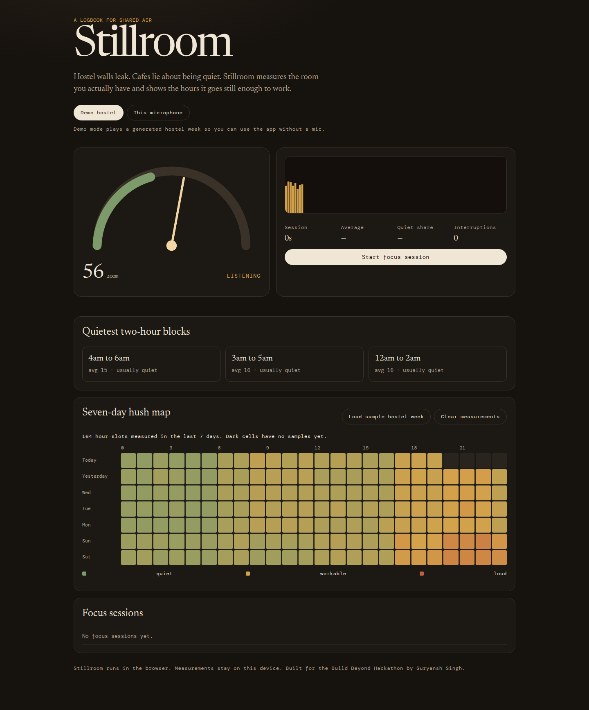
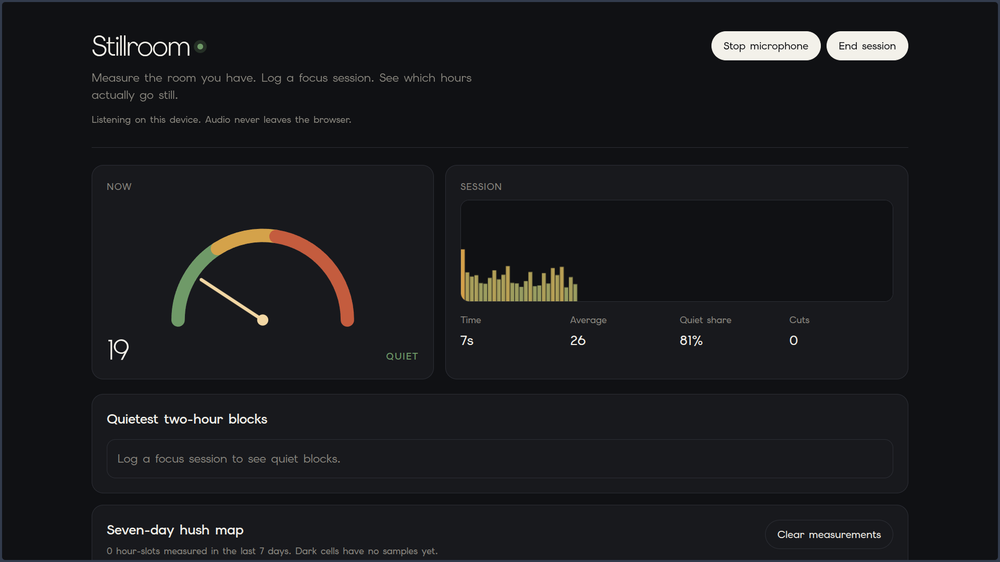
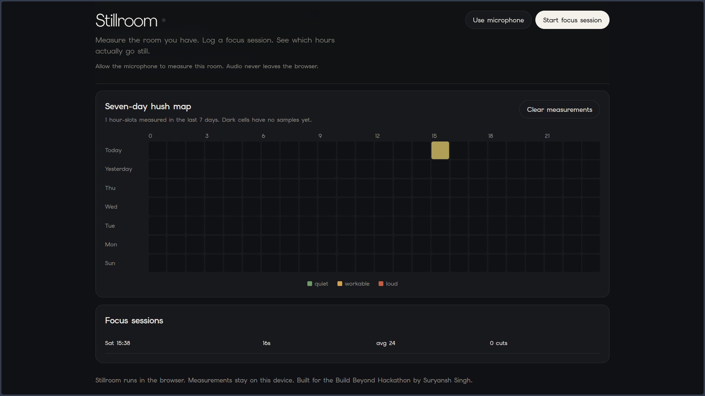

# Stillroom

Stillroom is a browser logbook for people who study in rooms they do not control. It measures how loud the space is, records focus sessions, and draws a seven-day map of when the room actually goes quiet.

**Live demo:** [jsDelivr static build](https://cdn.jsdelivr.net/gh/devSuryansh/build-beyond-hackathon-devpost@main/docs/index.html) · [StackBlitz](https://stackblitz.com/github/devSuryansh/build-beyond-hackathon-devpost) · [source](https://github.com/devSuryansh/build-beyond-hackathon-devpost)

## The idea

I have lost more evenings to "I'll start when it gets quieter" than I have to hard problem sets. Hostels, shared flats, and cafes do not publish a schedule for when the hallway goes still. You guess. You put on headphones. You still jump when a door slams.

Stillroom started as a way to stop guessing. If the room has a pattern, a week of measurements should show it. If it does not, you learn that too, and you stop waiting for a silence that is never coming.

## How it works

Open the app and pick a source. **Demo hostel** plays a generated week of hostel-like noise, so anyone without a microphone can still click through a full session. **This microphone** uses the Web Audio API on your device. Sound is processed locally and never uploaded.

The meter maps microphone RMS (or the demo signal) onto a 0-100 room score. Quiet is 32 and below. Workable holds until 55. Above that the room is loud.

Start a focus session when you sit down. Stillroom samples the score several times a second, counts interruptions when loudness stays high instead of spiking once, and writes a summary when you stop. Those samples also fill a 7-by-24 heatmap. From that grid it ranks the quietest two-hour blocks in your week.

Everything lives in `localStorage` on this browser. Clear measurements if you want a blank log. Load the sample hostel week if you want to see a populated map again.

## Main features

- Live room meter with a needle gauge and a scrolling loudness trace
- Demo mode that does not need microphone permission
- Focus sessions with duration, average score, quiet share, and interruption count
- Interruption detection with hysteresis, so one door slam is not three events
- Seven-day hush map, one cell per hour
- Quietest two-hour block ranking
- Sample hostel week you can load or throw away
- Local-only storage, no account

## Technology stack

- TypeScript
- Vite
- Vanilla DOM (no UI framework)
- Web Audio API (`AudioContext`, `AnalyserNode`, `getUserMedia`)
- `localStorage` for persistence
- Vitest for unit tests covering scoring, sessions, heatmap buckets, and storage parsing

## Intended audience

Students and anyone else who works in shared housing, hostels, or noisy cafes and wants a factual answer to "when is this place actually quiet?" It is also a small, inspectable Web Audio project if you are learning how to turn a microphone stream into something you can reason about.

## Team

Solo submission for the [Build Beyond Hackathon](https://build-beyond-hackathon.devpost.com/).

- **Suryansh Singh** ([devSuryansh](https://github.com/devSuryansh), Devpost: [devSuryansh](https://devpost.com/devSuryansh)). Idea, design, engineering, and writeup.

## Run it

```bash
npm install
npm test
npm run dev
```

`npm test` should print a passing Vitest summary. `npm run dev` starts Vite. The app is a static page, so `npm run build` and `npm run preview` are enough for a production-like check.

Devpost paste copy lives in [`DEVPOST.md`](DEVPOST.md).

## Demo visuals






